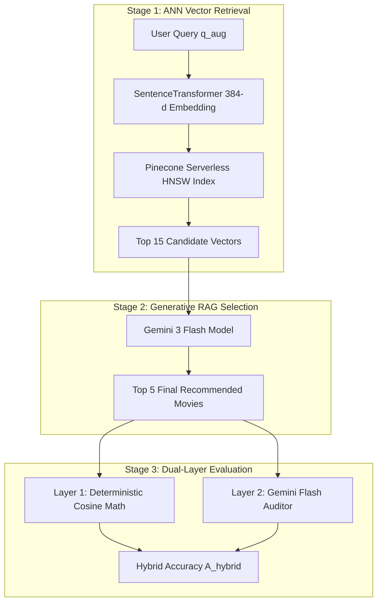

# Technical Specification: Dual-Layer LLM-as-a-Judge Evaluation Architecture

**Abstract**—This document provides the formal technical specification for the LLM-as-a-Judge evaluation framework implemented in the ScreenScout recommendation service. Designed according to IEEE software architectural standards, the framework addresses unsupervised vector retrieval validation by establishing a dual-layer metric system: deterministic 384-dimensional vector Cosine Similarity precision ($P_{\text{cosine}}$) and generative Likert relevance judging ($P_{\text{LLM}}$) via Gemini 3 Flash.

---

## I. SYSTEM SPECIFICATION & RAG PIPELINE



### A. Mathematical Formulation

1. **Composite Query Embedding:**
   $$\mathbf{v}_q = \text{Encoder}(q_{\text{aug}}) \in \mathbb{R}^{384}$$

2. **Approximate Nearest Neighbor (ANN) Retrieval:**
   $$\mathcal{C}_{15} = \text{TopK}_{15} \left( \left\{ \text{Sim}(\mathbf{v}_q, \mathbf{v}_i) \mid \mathbf{v}_i \in \mathcal{D}_{\text{Pinecone}} \right\} \right)$$

3. **Generative RAG Selection:**
   $$\mathcal{R}_{5} = \text{GeminiRAG}(\mathcal{C}_{15}, q_{\text{aug}})$$

---

## II. DUAL-LAYER EVALUATION METRICS

### A. Layer 1: Deterministic Vector Cosine Similarity Precision ($P_{\text{cosine}}$)
For each retrieved candidate $c_i \in \mathcal{R}_5$, the candidate's textual metadata (title and plot overview) is re-encoded into $\mathbf{v}_{c_i} \in \mathbb{R}^{384}$. The exact Cosine Similarity is computed as:

$$S_c(\mathbf{v}_q, \mathbf{v}_{c_i}) = \frac{\mathbf{v}_q \cdot \mathbf{v}_{c_i}}{\|\mathbf{v}_q\| \|\mathbf{v}_{c_i}\|}$$

- **Vector Precision Metric ($P_{\text{cosine}}$):**
  $$P_{\text{cosine}} = \frac{1}{|\mathcal{R}_5|} \sum_{c_i \in \mathcal{R}_5} \mathbb{I}\left( S_c(\mathbf{v}_q, \mathbf{v}_{c_i}) \ge 0.45 \right) \times 100\%$$

### B. Layer 2: LLM Auditor Likert Relevance Judging ($P_{\text{LLM}}$)
Gemini 3 Flash evaluates each candidate $c_i \in \mathcal{R}_5$ independently, assigning an integer relevance score $R(c_i) \in \{1, 2, 3, 4, 5\}$:

- **LLM Precision Metric ($P_{\text{LLM}}$):**
  $$P_{\text{LLM}} = \frac{1}{|\mathcal{R}_5|} \sum_{c_i \in \mathcal{R}_5} \mathbb{I}\left( R(c_i) \ge 3 \right) \times 100\%$$

- **Hit Rate Metric ($H@K$):**
  $$H@K = \mathbb{I}\left( \max_{c_i \in \mathcal{R}_5} R(c_i) \ge 4 \right) \times 100\%$$

### C. Layer 3: Hybrid Accuracy Formulation ($A_{\text{hybrid}}$)
$$\text{Hybrid Accuracy } A_{\text{hybrid}} = 0.5 \cdot P_{\text{cosine}} + 0.5 \cdot P_{\text{LLM}}$$

---

## III. ZERO-OVERHEAD PERSISTENCE & EXECUTION

### A. Non-Blocking Lifespan Execution
To prevent cold-start latency blocking on PaaS deployment environments (Azure/Render), evaluation runs asynchronously inside FastAPI's `lifespan` hook via `asyncio.create_task()`:

```python
# app/main.py - Non-blocking startup hook
asyncio.create_task(run_background_eval())
```

### B. Cloud Metadata Persistence
Audit execution metrics are written directly to Pinecone vector metadata (`namespace="audit_logs"`, `id="sys_audit_latest"`), preserving historical benchmark results across ephemeral container lifecycles without requiring external databases.

---

## IV. API & CLI EXECUTION INTERFACE

### A. Command Line Interface (CLI)
```bash
python eval_llm_judge.py --samples 5 --output eval_report.json
```

### B. RESTful API Endpoint
```http
GET /recommend/evaluate?samples=5
Host: https://api.screenscout.com
```
