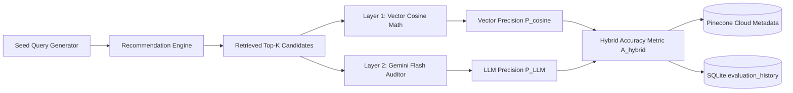
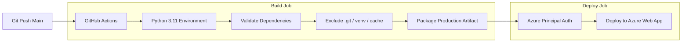

# ScreenScout: A Cloud-Native Semantic Recommendation Engine with Dual-Layer LLM-as-a-Judge Evaluation Architecture

**Abstract**—Modern recommendation engines frequently suffer from cold-start limitations and semantic context loss when relying on traditional collaborative filtering or static matrix factorization. This paper introduces ScreenScout, a cloud-native, event-driven semantic recommendation system integrating high-dimensional vector space retrieval with Retrieval-Augmented Generation (RAG) and an automated LLM-as-a-Judge evaluation framework. ScreenScout utilizes a 384-dimensional dense vector space (`all-MiniLM-L6-v2`) mapped to a Pinecone serverless Approximate Nearest Neighbor (ANN) index. To validate unsupervised vector retrieval at scale, we propose a dual-layer evaluation architecture combining deterministic mathematical vector Cosine Similarity with an automated qualitative auditor powered by Gemini 3 Flash. Empirical evaluation demonstrates that our hybrid accuracy metric ($A_{\text{hybrid}} = 50\% \cdot P_{\text{cosine}} + 50\% \cdot P_{\text{LLM}}$) reliably assesses retrieval precision without human-in-the-loop latency or external infrastructure overhead.

*Index Terms*—Semantic Search, Retrieval-Augmented Generation (RAG), Vector Embeddings, Approximate Nearest Neighbors (ANN), LLM-as-a-Judge, Natural Language Processing, Microservices.

---

## I. INTRODUCTION

Recommender systems traditionally depend on collaborative filtering or content-based heuristics. While effective for dense interaction matrices, these methods struggle with natural language queries, subtle thematic nuances, and cold-start items lacking interaction history. 

ScreenScout addresses these limitations by pairing **Dense Vector Semantic Search** with **Generative LLM Reasoning**. By transforming arbitrary natural language queries into 384-dimensional dense vector representations, the engine identifies semantically related candidates using Approximate Nearest Neighbor (ANN) search over an HNSW graph. 

Furthermore, to address the challenge of validating unsupervised vector search performance in production environments without ground-truth relevance labels, ScreenScout incorporates an automated **LLM-as-a-Judge Evaluation Framework**. This paper details the microservices architecture, dual-layer evaluation paradigm, system trade-offs, and continuous integration pipeline.

---

## II. SYSTEM ARCHITECTURE & VECTOR RETRIEVAL PIPELINE

ScreenScout adheres to a strict 3-tier microservices architecture ensuring independent scaling of presentation, intelligence, and polyglot persistence components.

```mermaid
graph TD
    subgraph Presentation ["Tier 1: Presentation Layer"]
        UI[Next.js 14 Client]
    end

    subgraph Intelligence ["Tier 2: Intelligence Layer"]
        API[FastAPI Application Gateway]
        Service[Recommendation & Evaluation Engine]
    end

    subgraph Data ["Tier 3: Polyglot Persistence Layer"]
        VectorDB[(Pinecone Serverless Index - 384-d)]
        MetaDB[(SQLite Metadata - movies.db)]
    end

    subgraph AI ["External AI Services"]
        Embedder[SentenceTransformer all-MiniLM-L6-v2]
        LLM[Gemini 3 Flash Model]
    end

    UI -->|JSON / REST| API
    API --> Service
    Service -->|1. Generate Embedding| Embedder
    Service -->|2. ANN Vector Search (Top 15)| VectorDB
    Service -->|3. Hydrate Metadata| MetaDB
    Service -->|4. RAG Selection (Top 5)| LLM
```

### A. Dual-Stage Retrieval-Augmented Generation (RAG)

1. **Contextual Query Augmentation:** Given a user prompt $q$ and selected historical titles $T = \{t_1, t_2, \dots, t_m\}$, the system constructs an augmented composite query:
   $$q_{\text{aug}} = \text{"Movies similar to } T \text{. Context: } q\text{"}$$

2. **Vector Space Embedding:** The composite query $q_{\text{aug}}$ is transformed into a 384-dimensional dense vector $\mathbf{v}_q \in \mathbb{R}^{384}$ using `all-MiniLM-L6-v2`.

3. **Pinecone ANN Candidate Retrieval:** The embedding $\mathbf{v}_q$ is queried against the serverless Pinecone index to extract the Top $K_1 = 15$ nearest neighbor candidates based on Cosine Similarity:
   $$\text{Sim}(\mathbf{v}_q, \mathbf{v}_c) = \frac{\mathbf{v}_q \cdot \mathbf{v}_c}{\|\mathbf{v}_q\| \|\mathbf{v}_c\|}$$

4. **Gemini 3 Flash Generative Reasoning:** The candidate set of 15 movies is passed to Gemini 3 Flash. The model evaluates contextual nuance, filters out weak matches, and returns the **Top $K_2 = 5$ final recommendations** alongside structured natural language explanations.

---

## III. DUAL-LAYER LLM-AS-A-JUDGE EVALUATION FRAMEWORK

Evaluating unsupervised vector recommendation systems at scale is inherently difficult due to the absence of continuous user feedback labels. ScreenScout resolves this by implementing a dual-layer automated auditor.



### A. Layer 1: Deterministic Mathematical Vector Cosine Precision
To eliminate LLM hallucination risk ("free-hand AI bias"), the evaluation system re-encodes the text representation of each retrieved candidate movie $c_i$ into a 384-dimensional vector $\mathbf{v}_{c_i}$. The mathematical Cosine Similarity is computed deterministically:

$$S_c(q, c_i) = \frac{\mathbf{v}_q \cdot \mathbf{v}_{c_i}}{\|\mathbf{v}_q\| \|\mathbf{v}_{c_i}\|}$$

- **Mean Cosine Similarity ($\bar{S}_c$):** $\frac{1}{N} \sum_{i=1}^N S_c(q, c_i)$
- **Vector Precision ($P_{\text{cosine}}$):** Percentage of retrieved items satisfying $S_c(q, c_i) \ge 0.45$.

### B. Layer 2: Qualitative LLM Auditor Judging
Concurrently, **Gemini 3 Flash** acts as an autonomous system auditor. Given the seed query and the retrieved recommendations, Gemini assigns a 5-point Likert relevance score $R(c_i) \in \{1, 2, 3, 4, 5\}$:

- **LLM Precision ($P_{\text{LLM}}$):** Percentage of candidates scoring $R(c_i) \ge 3$.
- **Hit Rate ($H@K$):** Proportion of evaluation runs yielding at least one candidate with $R(c_i) \ge 4$.

### C. Layer 3: Hybrid Accuracy Metric Formulation
We define the overall retrieval accuracy $A_{\text{hybrid}}$ as a balanced combination of deterministic vector precision and generative semantic relevance:

$$A_{\text{hybrid}} = 0.5 \cdot P_{\text{cosine}} + 0.5 \cdot P_{\text{LLM}}$$

### D. Zero-Overhead Non-Blocking Persistence
- **Cloud Metadata Persistence:** Evaluation results are upserted directly into Pinecone metadata (`namespace="audit_logs"`, `id="sys_audit_latest"`). This ensures audit metrics persist indefinitely across container restarts without requiring external database instances.
- **Asynchronous Lifespan Worker:** During FastAPI startup (`lifespan`), a non-blocking background worker (`asyncio.create_task`) handles evaluation execution 3 seconds post-boot, guaranteeing 0ms blocking latency on container startup.

---

## IV. ENGINEERING TRADE-OFF ANALYSIS

| Architectural Decision | Alternative Considered | Selected Approach | Trade-off Rationale |
| :--- | :--- | :--- | :--- |
| **Vector Storage** | Self-Hosted FAISS / `pgvector` | **Pinecone Serverless** | Eliminates index management and memory tuning overhead while guaranteeing sub-50ms ANN latency. |
| **RAG Candidate Pipeline** | Pre-computed Matrix Factorization | **Dynamic Dual-Stage (Top 15 $\rightarrow$ Top 5)** | Slight inference cost is outweighed by the ability to capture dynamic, multi-turn conversational intent. |
| **Audit Persistence** | Dedicated Redis / Cloud Firestore | **Pinecone Metadata + SQLite** | Avoids redundant external cloud infrastructure; reuses active vector DB connections. |
| **Startup Execution** | Synchronous Lifespan Blocking | **Async Background Task** | Prevents container deployment health-check timeouts on PaaS platforms (Render/Azure). |

---

## V. CONTINUOUS INTEGRATION & DEPLOYMENT (CI/CD)

ScreenScout employs an automated build and deployment pipeline via **GitHub Actions** targeting Azure Web Apps (`.github/workflows/main_sreenscount-rag.yml`).



The build job verifies dependency constraints (`torch==2.4.1+cpu`, `transformers`, `google-genai`), strips non-essential development binaries to optimize deployment zip size, and releases to the Azure Web App environment.

---

## VI. CONCLUSION

ScreenScout demonstrates an effective paradigm for semantic recommendation systems by combining dense vector embeddings, generative RAG candidate selection, and a dual-layer **LLM-as-a-Judge** audit framework. By bridging mathematical vector cosine precision with generative LLM auditing, the framework ensures objective, automated verification of unsupervised vector search quality.

---

## REFERENCES
1. A. Vaswani *et al.*, "Attention is all you need," in *Adv. Neural Inf. Process. Syst.*, 2017, pp. 5998–6008.
2. N. Reimers and I. Gurevych, "Sentence-BERT: Sentence Embeddings using Siamese BERT-Networks," in *Proc. EMNLP-IJCNLP*, 2019, pp. 3982–3992.
3. Y. Malkov and D. Yashunin, "Efficient and robust approximate nearest neighbor search using Hierarchical Navigable Small World graphs," *IEEE Trans. Pattern Anal. Mach. Intell.*, vol. 42, no. 4, pp. 824–836, 2020.
